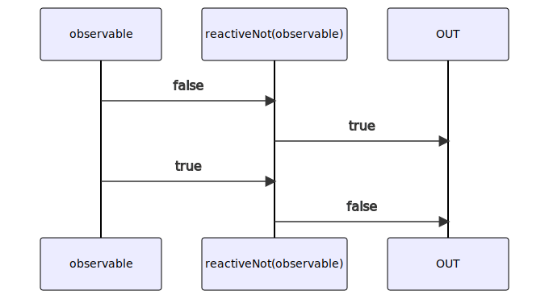

# reactiveNot

Alternative: `not$$`

### Types

```ts
function reactiveNot(
 subscribe: IObservable<boolean>,
): IObservable<boolean>
```

### Definition

Creates an Observable which performs the boolean `NOT` operation (`!`) on the values sent by one Observable, and emits the result.

### Diagram



### Example

#### Perform the boolean "NOT" of two Observables

```ts
const subscribe = reactiveNot(
  single(true),
);

subscribe((value: boolean) => {
  console.log(value);
});
```

Output:

```text
false
```
