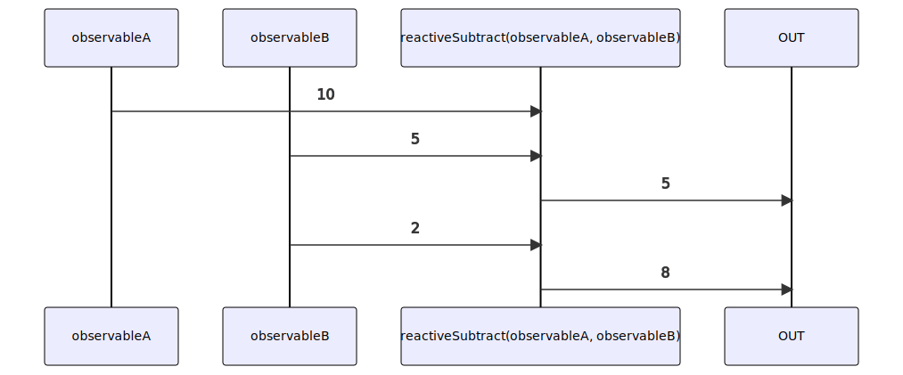

# reactiveSubtract

Alternatives: `sub$$`, `subtract$$`

### Types

```ts
function reactiveSubtract(
  a: IObservable<number>,
  b: IObservable<number>,
): IObservable<number>
```

### Definition

Creates an Observable which performs a subtraction (`-`) between the values sent by two Observables, and emits the result.

### Diagram



### Perform the "subtraction" of two Observables

####

```ts
const subscribe = reactiveSubtract(
  single(10),
  single(5),
);

subscribe((value: number) => {
  console.log(value);
});
```

Output:

```text
5
```
