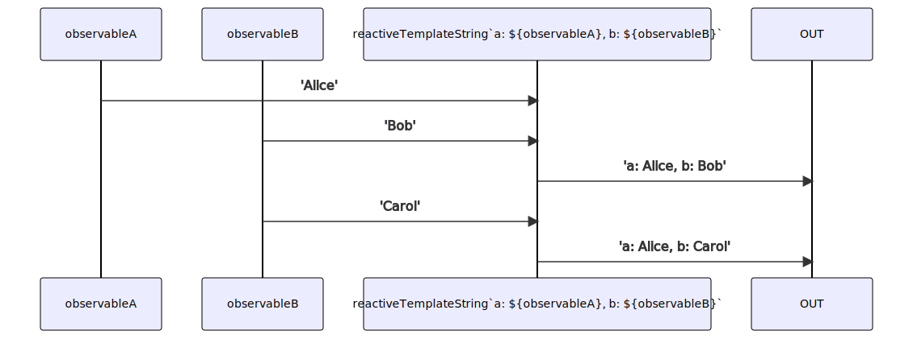

# reactiveTemplateString

Alternative: `string$$`

### Types

```ts
function reactiveTemplateString(
  parts: TemplateStringsArray | string[],
  ...observables: IObservable<any>[]
): IObservable<string>
```

### Definition

Creates an Observable from a [template literal](https://developer.mozilla.org/en-US/docs/Web/JavaScript/Reference/Template_literals).
If any of the members (Observables) of the template string change, it re-generates the string and send it.

### Diagram



### Example

#### Compute the fullname of a user from its firstname and lastname

```ts
const firstname$ = single('Valentin');
const lastname$ = single('Richard');

const fullname$ = reactiveTemplateString`${firstname$} ${lastname$}`;

fullname$((value: boolean) => {
  console.log(value);
});
```

Output:

```text
Valentin Richard
```
