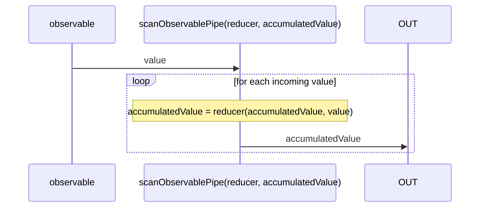
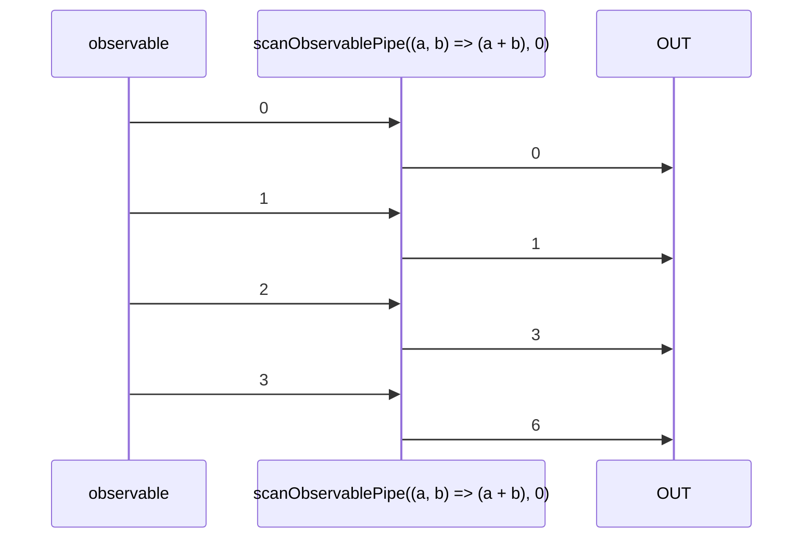

# scanObservablePipe

Alternative: `scan$$$`

Inlined: `scanObservable`, `scan$$`

### Types

```ts
function scanObservablePipe<GIn, GOut>(
  scanFunction: IScanFunction<GIn, GOut>,
  initialValue: GOut,
): IObservablePipe<GIn, GOut>
```

### Definition

Applies an accumulator (or "reducer function") to each value from the source Observable from an initial value (second argument).
This accumulated value is then emitted.

### Diagram

#### Algorithm



#### Example



### Example

#### Compute the sum of incoming values

```ts
const subscribe = pipe$$(of(0, 1, 2, 3), [
  scan$$$((sum: number, value: number): number => {
    return sum + value;
  }, 0),
]);

subscribe((value) => {
  console.log(value);
});
```

Output:

```text
0
1
3
6
```


