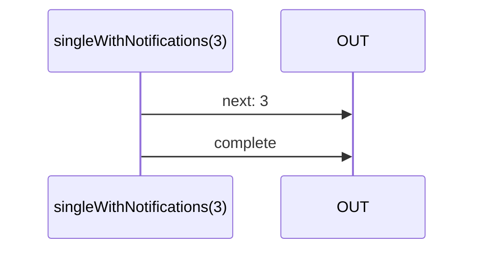

# singleWithNotifications

Alternative: `singleN`

### Types

```ts
function singleWithNotifications<GValue>(
  value: GValue,
): IObservable<GValue>
```

### Definition

Creates an Observable, which on subscribe, will emit `value` in a `next` Notification,
and then will emit a `complete` Notification.

It is somehow equivalent of a `Promise.resolve`.

### Diagram



### Examples

#### Example 1

```ts
const subscribe = singleWithNotifications(3);

subscribe((notification) => {
  console.log(notification.name, notification.value);
});
```


Output:

```text
'next', 1
'complete', undefined
```

#### Example 2

```ts
const subscribe = singleWithNotifications(3);

toPromiseLast(subscribe)
  .then((value: number) => {
    console.log(value);
  });
```


Output:

```text
3
```
