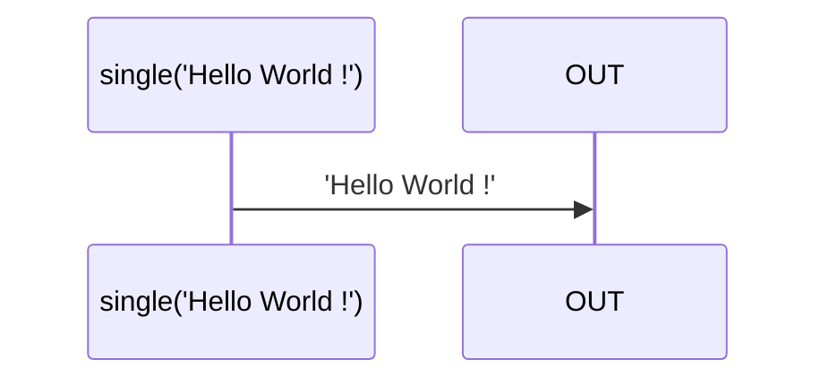

# single

### Types

```ts
function single<GValue>(
  value: GValue,
): IObservable<GValue>
```

### Definition

Creates an Observable from a single value. It emits this value when subscribed.

:::caution

This is not equivalent of the RxJS [single](https://rxjs.dev/api/index/function/single) function.

:::


### Diagram



### Example

#### Emits the value 'Hello World !'

```ts
const subscribe = single('Hello World !');

subscribe((value: string) => {
  console.log(value);
});
```

Output:

```text
Hello World !
```


