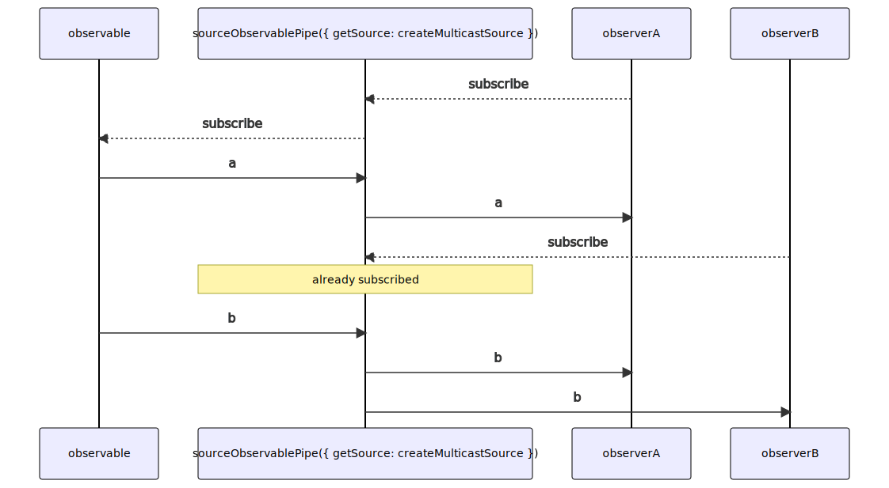

# sourceObservablePipe

### Types

```ts
function sourceObservablePipe<GValue>(
  options: ISourceObservableOptions<GValue>,
): IObservablePipe<GValue, GValue>
```

```ts
interface ISourceObservableOptions<GValue> {
  getSource: ISourceObservablePipeGetSource<GValue>;
  subscribePoint?: number;
  unsubscribePoint?: number;
}

interface ISourceObservablePipeGetSource<GValue> {
  (): ISource<GValue>;
}
```

### Definition

This ObservablePipe does the bridge between a Source which is not lazy loaded, and an Observable (which is lazy loaded).

It counts the number of subscriptions and subscribes (only once) to the Observable if the number of
subscriptions is equal to `subscribePoint` (default: 1). The received value is then emitted in the source.

If the number of subscriptions is equal to `unsubscribePoint` (default: 0), it unsubscribes from the Observable.

When a subscription occurs, it is transmitted to the Source (same when unsubscribing).

So by default, this pipe subscribes to the original observable on the first subscription,
and unsubscribes of it when no one remains.

This is partially equivalent to the *[multicast](https://rxjs-dev.firebaseapp.com/api/operators/multicast)*
and *[refCount](https://rxjs-dev.firebaseapp.com/api/operators/refCount)* operators, but it is more generic.

:::caution

You will probably never user directly this ObservablePipe, instead you may use:
[shareObservablePipeWithMulticastReplaySource](/docs/reference/share-observable-pipe-with-multicast-replay-source/)
or
[shareObservablePipeWithMulticastReplayLastSource](/docs/reference/share-observable-pipe-with-multicast-replay-last-source/).

:::

### Diagram



### Example

#### Sharing the same Observable

```ts
const subscribe = pipe$$(interval(1000), [
  scan$$$<void, number>(count => (count + 1), 0),
  sourceObservablePipe<number>({ getSource: createMulticastSource }),
]);

subscribe((value: number) => {
  console.log('value - A:', value);
});

subscribe((value: number) => {
  console.log('value - B:', value);
});
```

Output:

```text
value - A: 0
value - B: 0
value - A: 1
value - B: 1
...
```

