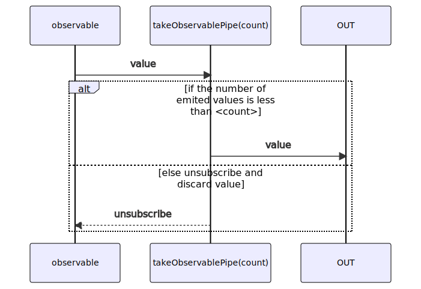
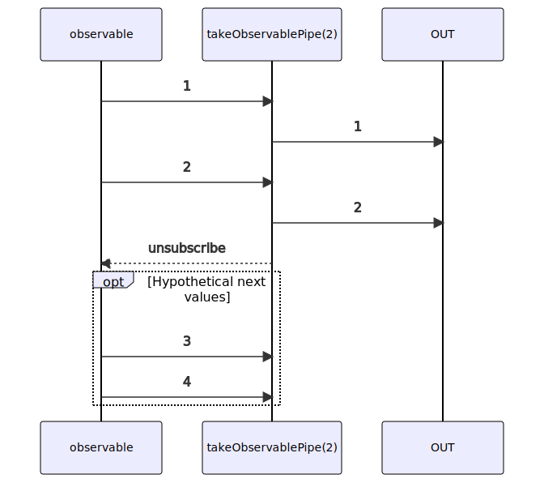

# takeObservablePipe

Alternative: `take$$$`

Inlined: `takeObservable`, `take$$`

### Types

```ts
function takeObservablePipe<GValue>(
  count: number,
): IObservablePipe<GValue, GValue>
```

### Definition

This pipe emits only the first `count` values emitted by the source Observable.

The RxJS equivalent is [take](https://rxjs.dev/api/operators/take).

### Diagram

#### Algorithm



#### Example



### Example

#### Display only the first 2 emitted values

```ts
const subscribe = pipe$$(of(1, 2, 3, 4), [
  take$$$(2),
]);

subscribe((value: number) => {
  console.log(value);
});
```

Output:

```text
1
2
```

