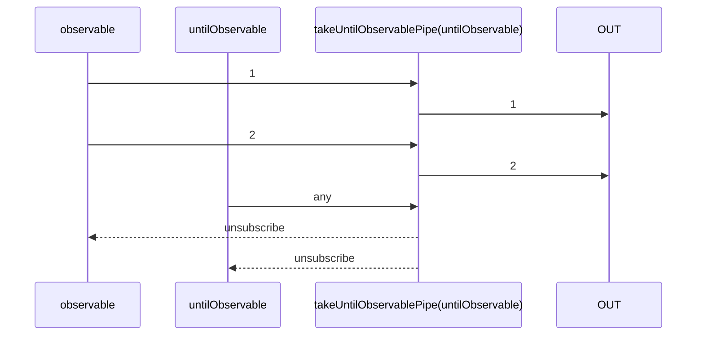

# takeUntilObservablePipe

Alternative: `takeUntil$$$`

Inlined: `takeUntilObservable`, `takeUntil$$`

### Types

```ts
function takeUntilObservablePipe<GValue>(
  until: IObservable<any>,
): IObservablePipe<GValue, GValue>
```

### Definition

This pipe emits the values emitted by the source Observable until an Observable (`until`) emits a value.

The RxJS equivalent is [takeUntil](https://rxjs.dev/api/index/function/takeUntil).

### Diagram



### Example

#### Display values until a 4500ms timeout is reached

```ts
const until$ = timeout(4500);

const subscribe = pipe$$(interval(1000), [
  scan$$$<void, number>(count => (count + 1), 0),
  takeUntil$$$<number>(until$),
]);

subscribe((value: number) => {
  console.log(value);
});
```

Output:

```text
// t = 1000ms
1
// t = 2000ms
2
// t = 3000ms
3
// t = 4000ms
4
// t = 4500ms => unsubscribe
```

