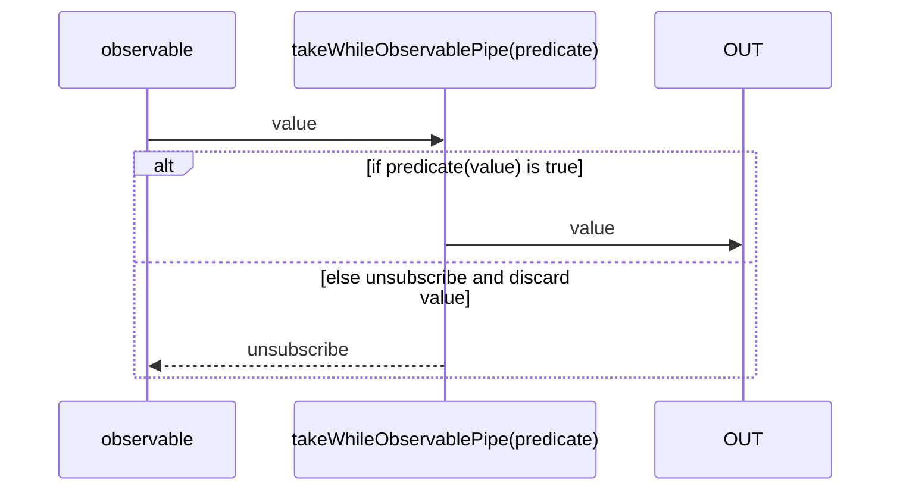
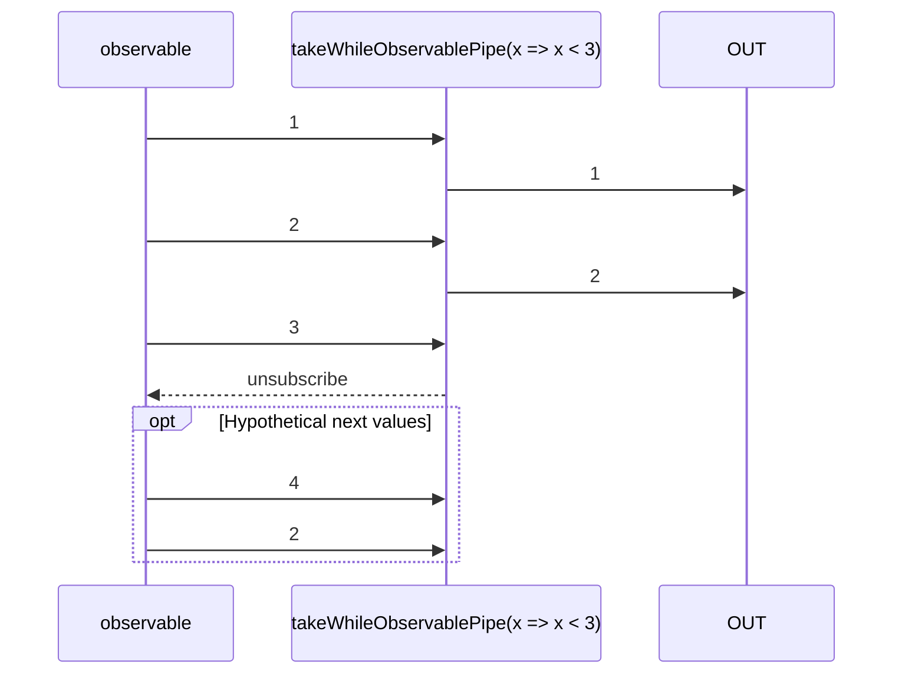

# takeWhileObservablePipe

Alternative: `takeWhile$$$`

Inlined: `takeWhileObservable`, `takeWhile$$`

### Types

```ts
function takeWhileObservablePipe<GValue>(
  predicate: ITakeWhileObservablePredicateFunction<GValue>,
): IObservablePipe<GValue, GValue>
```

### Definition

This pipe emits values sent by the source Observable so long as each value satisfies the given `predicate`,
and then stops as soon as this predicate is not satisfied.

The RxJS equivalent is [takeWhile](https://rxjs.dev/api/index/function/takeWhile).

### Diagram

#### Algorithm



#### Example



### Example

#### Take values as long as they are lower than 3

```ts
const subscribe = pipe$$(of(1, 2, 3, 4), [
  takeWhile$$$(x => x < 3),
]);

subscribe((value: number) => {
  console.log(value);
});
```

Output:

```text
1
2
```

