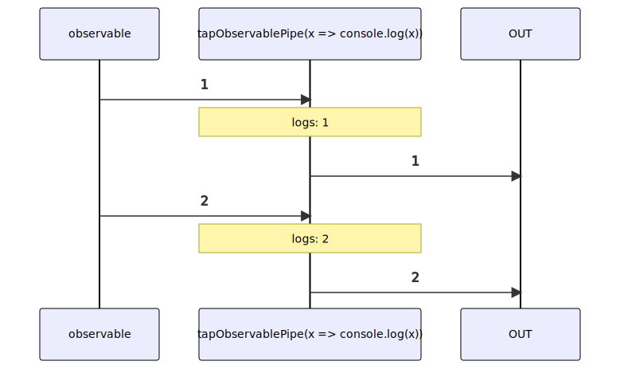

# tapObservablePipe

Alternative: `tap$$$`

Inlined: `tapObservable`, `tap$$`

### Types

```ts
function tapObservablePipe<GValue>(
  tapFunction: ITapFunction<GValue>,
): IObservablePipe<GValue, GValue>
```

### Definition

This pipe returns an Observable identical to the source, but runs the specified callback for each item.

This is mainly used when you want to affect outside state with a notification without altering the notification.

The RxJS equivalent is [tap](https://rxjs-dev.firebaseapp.com/api/index/function/tap).


### Diagram



### Example

#### Log incoming values

```ts
const subscribe = pipe$$(of(0, 1, 2), [
  tap$$$(x => console.log(x)),
]);

subscribe((value) => {
  // ...
});
```

Output:

```text
0
1
2
```


