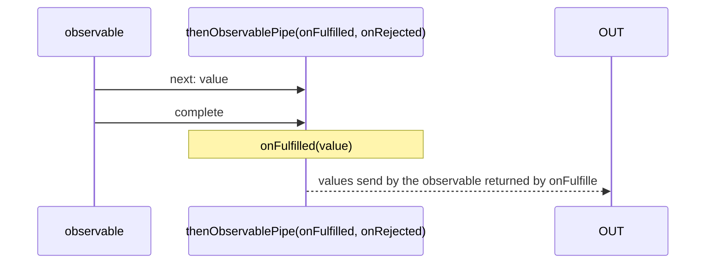
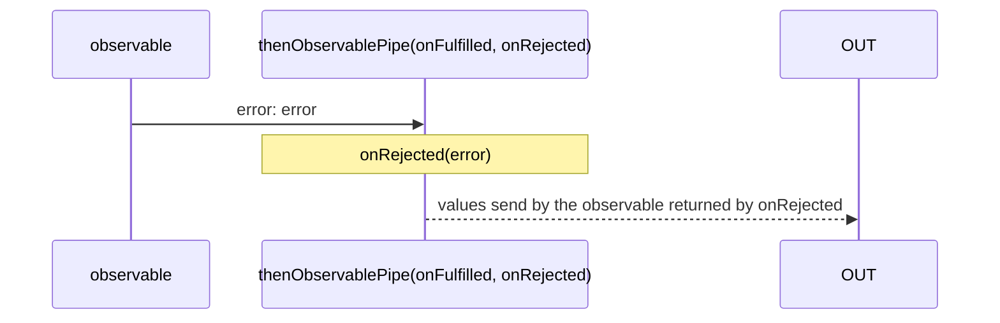

# thenObservablePipe

Alternative: `then$$$`

Inlined: `thenObservable`, `then$$`

### Types

```ts
function thenObservablePipe<GInNextValue, GOut>(
  onFulfilled: IThenObservableOnFulfilled<GInNextValue, GOut>,
  onRejected: IThenObservableOnRejected<GOut>,
): IObservablePipe<IThenObservableInNotifications<GInNextValue>, GOut>
```

```ts
interface IThenObservableOnFulfilled<GInNextValue, GOut> {
  (value: GInNextValue): IObservable<GOut>;
}

interface IThenObservableOnRejected<GOut> {
  (error: any): IObservable<GOut>;
}
```

### Definition

This function is similar to the method `.then` of a Promise.

It subscribes to an *Observable* that emits some Notifications (`next`, `complete` and `error`).

If a `complete` Notification is received, it calls `onFulfilled` with the last received value coming from a `next` Notification.

If an `error` Notification is received, it calls `onRejected` with this error.

Then, it emits the values from the Observable returned by `onFulfilled` or `onRejected`.

This is useful to mimic the behaviour of Promises but with Observables.

It comes with some helpers:

- [fulfilledObservablePipe](/docs/reference/fulfilled-observable-pipe/)
- [rejectedObservablePipe](/docs/reference/rejected-observable-pipe/)
- [finallyObservablePipe](/docs/reference/finally-observable-pipe/)
- [thenAnyObservablePipe](/docs/reference/then-any-observable-pipe/)


:::caution

Do not throw into any of `onFulfilled` or `onRejected` and expects that it will send an `error` Notification.
Instead, use `throwError`.

:::

### Diagrams

#### fulfilled



#### rejected



### Example

#### Fetch a text document

```ts
const subscribe = pipe$$(fromFetch(`https://www.w3.org/TR/PNG/iso_8859-1.txt`), [
  then$$$(
    (response: Response): IObservable<IFromPromiseObservableNotifications<string>> => {
      if (response.ok) {
        return fromPromise(response.text());
      } else {
        return throwError(createNetworkError());
      }
    },
    (error: any): IObservable<IDefaultNotificationsUnion<string>> => {
      if (navigator.onLine) {
        return throwError(error);
      } else {
        return singleWithNotifications('Offline');
      }
    }
  ),
]);

subscribe((notification) => {
  console.log(notification.name, notification.value);
});
```

Output (*if request succeed*):

```text
'next', 'The following are the gr...'
'complete', undefined
```
