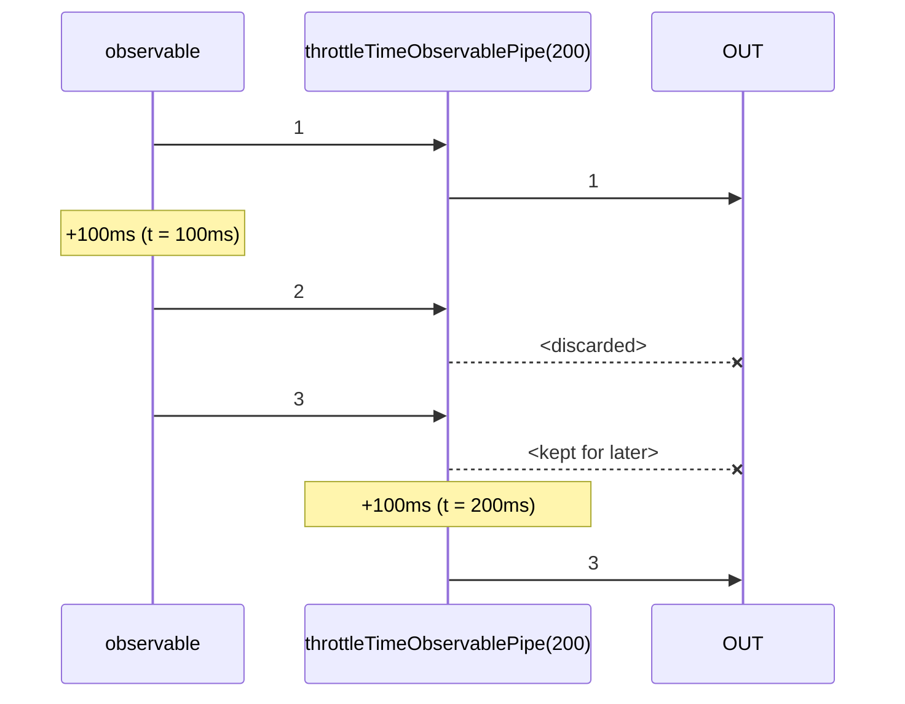

# throttleTimeObservablePipe

Alternative: `throttleTime$$$`

Inlined: `throttleTimeObservable`, `throttleTime$$`

### Types

```ts
function throttleTimeObservablePipe<GValue>(
  duration: number,
  options?: IThrottleTimeObservablePipeOptions,
): IObservablePipe<GValue, GValue>
```

```ts
interface IThrottleTimeObservablePipeOptions {
  leading?: boolean; // (default: true)
  trailing?: boolean; // (default: true)
}
```

### Definition

When a value is received:

- if `leading` is true or the last received value was earlier than `duration` ms, emits the value
- else if `trailing` is true, start a timer until `duration` ms are elapsed, which will emit the last received value.

As result, a value if emitted evey `duration` ms at best.

You'll mainly use this function to limit the number of values send by an Observable, based on a period of time.

The RxJS equivalent is [throttleTime](https://rxjs.dev/api/operators/throttleTime).

### Diagram



### Example

#### Throttle user clicks

```ts
const subscribe = pipe$$(fromEventTarget(window, 'click'), [
  throttleTime$$$(200),
]);

subscribe(() => {
  console.log('clicked');
});
```

Timeline:

```text
// t = 0ms: user clicks
'clicked'
// t = 100ms: user clicks
// t = 200ms
'clicked'
// t = 300ms: user clicks
// t = 350ms: user clicks
// t = 400ms
'clicked'
```


