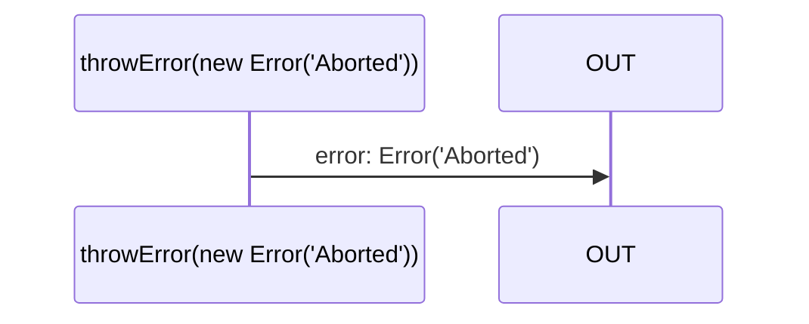

# throwError

### Types

```ts
function throwError<GError>(
  error: GError,
): IObservable<IErrorNotification<GError>>
```

### Definition

Creates an Observable, which on subscribe, will emit `error` in an `error` Notification.

It is somehow equivalent of a `Promise.reject`.

### Diagram



### Examples

#### Example 1

```ts
const subscribe = throwError(new Error(`Aborted`));

subscribe((notification) => {
  console.log(notification.name, notification.value);
});
```


Output:

```text
'error', Error(`Aborted`)
```

#### Example 2

```ts
const subscribe = throwError(new Error(`Aborted`));

toPromiseLast(subscribe)
  .catch((value: unknown) => {
    console.log(value);
  });
```


Output:

```text
Error(`Aborted`)
```
