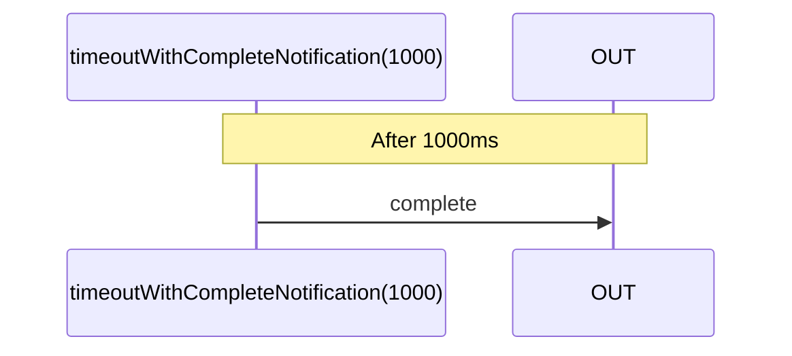

# timeoutWithCompleteNotification

Alternative: `timeoutCN`

### Types

```ts
function timeoutWithCompleteNotification(
  duration: number,
): IObservable<ICompleteNotification>
```

### Definition

Creates an Observable that emits a `complete` Notification after a specified duration of time.

### Diagram



### Example

#### Delay an HTTP request by 2000ms

```ts
const subscribe = pipe$$(fromFetchJSON('https://api.org'), [
  finally$$$(() => timeoutWithCompleteNotification(2000)),
]);

subscribe((notification) => {
  console.log(notification.name, notification.value);
});
```

Output:

*if fulfilled*

```text
'next', { ...json data }
'complete'
```

*else*

```text
'error', Error
```
