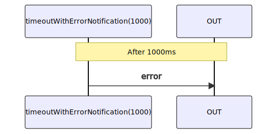

# timeoutWithErrorNotification

Alternative: `timeoutEN`

### Types

```ts
function timeoutWithErrorNotification(
  duration: number,
): IObservable<IErrorNotification<ITimeoutError>>
```

### Definition

Creates an Observable that emits an `error` Notification after a specified duration of time.

### Diagram



### Example

#### Abort an HTTP request after a specific timeout

```ts
const request$ = fromFetchJSON('https://api.org');
const timeout$ = timeoutWithErrorNotification(2000);

const subscribe = raceWithNotifications([
  request$,
  timeout$,
]);

subscribe((notification) => {
  console.log(notification.name, notification.value);
});
```

Output:

*if fulfilled in less than 2000ms*

```text
'next', { ...json data }
'complete'
```

*else*

```text
'error', Error
```
