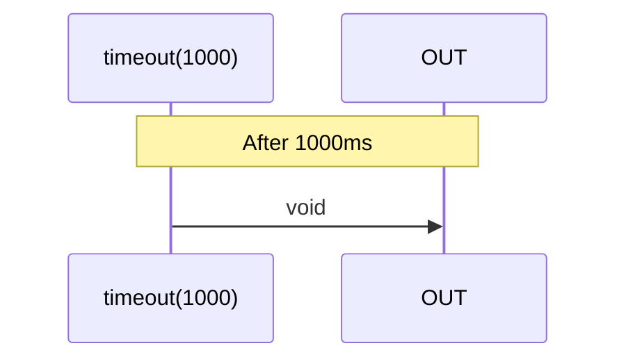

# timeout

### Types

```ts
function timeout(
  duration: number,
): IObservable<void>;

function timeout<GValue>(
  duration: number,
  getValue?: () => GValue,
): IObservable<GValue>;
```

### Definition

Creates an Observable that emits void or the return of `getValue` after a specified duration of time.

### Diagram



### Example

#### Print 'timeout' after a period of 1000ms

```ts
const subscribe = timeout(1000);

subscribe(() => {
  console.log('timeout');
});
```

Output:

```text
timeout
```

