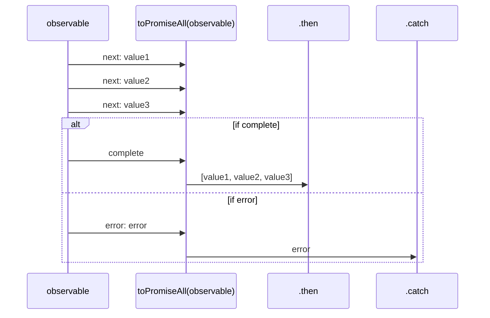
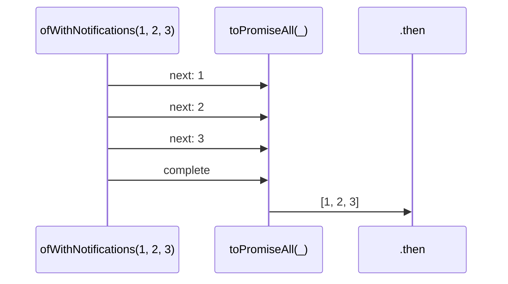

# toPromiseAll

### Types

```ts
function toPromiseAll<GValue>(
  subscribe: IObservable<IObservableToPromiseNotifications<GValue>>,
  options?: IObservableToPromiseAllOptions,
): Promise<GValue[]>
```

```ts
interface IObservableToPromiseAllOptions extends IObservableToPromiseOptions {
  maxNumberOfValues?: number; // (default: Infinity)
}

type IObservableToPromiseNotifications<GValue> = IDefaultInNotificationsUnion<GValue>;
```

### Definition

Converts an Observable of Notifications into a Promise, resolved with an array of values.

The Observable must emit the following Notifications:

- `next`: the values to resolve the promise with
- `complete`: resolves the promise with all the `next` values
- `error`: rejects the promise with the received error

You may provide a `IObservableToPromiseAllOptions`, which may be used to force an abort from an external
AbortSignal: this is useful if you want to abort any pending work and unsubscribe from the provided Observable,
before it completes.
If this signal is aborted, the promise is rejected with an `AbortError`.

### Diagram

#### Algorithm



#### Example



### Examples

#### Resolves with [1, 2, 3]

```ts
toPromiseAll(ofWithNotifications(1, 2, 3))
  .then((values: number[]) => {
    console.log(values);
  });
```

Output:

```text
[1, 2, 3]
```

#### Rejects with an error

```ts
toPromiseAll(throwError(new Error('Custom Error')))
  .catch((error: unknown) => {
    console.log(error);
  });
```

Output:

```text
Error('Custom Error')
```

