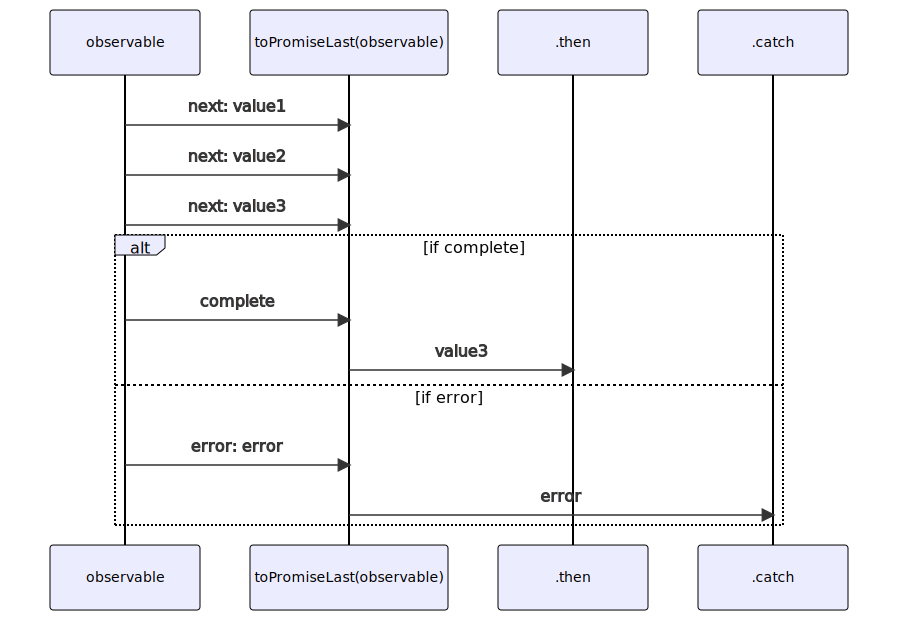
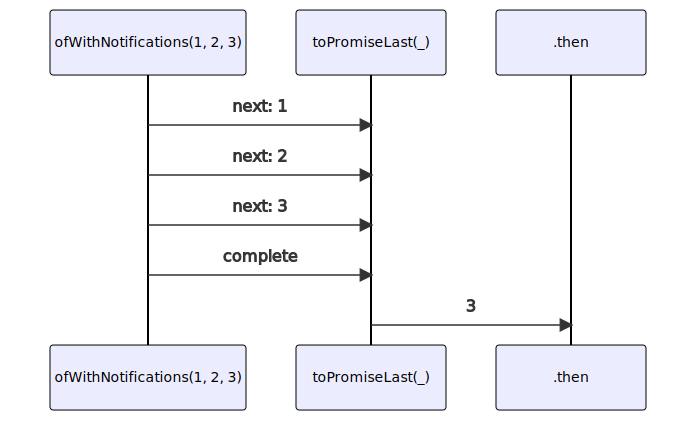

# toPromiseLast

### Types

```ts
function toPromiseLast<GValue>(
  subscribe: IObservable<IObservableToPromiseNotifications<GValue>>,
  options?: IObservableToPromiseLastOptions
): Promise<GValue>
```

### Definition

Converts an Observable of Notifications into a Promise.

It's similar to [toPromiseAll](/docs/reference/to-promise-all/),
but it returns the last received `next` value instead of an Array.

### Diagram

#### Algorithm



#### Example



### Examples

#### Simple http request

```ts
toPromiseLast(fromFetch('https://some-url.site'))
  .then((response: Response) => {
    console.log(response.statusText);
  });
```

#### Simple http request aborted

```ts
const controller = new AbortController();

toPromiseLast(fromFetch('https://some-url.site'), { signal: controller.signal })
  .then((response: Response) => {
    console.log(response.statusText);
  });

controller.abort(); // the request is properly aborted
```

