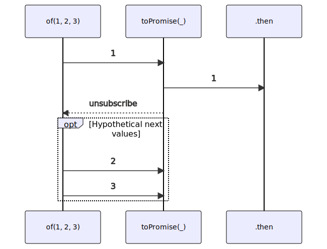

# toPromise

### Types

```ts
function toPromise<GValue>(
  subscribe: IObservable<GValue>,
  options?: IObservableToPromiseOptions
): Promise<GValue>
```

```ts
interface IObservableToPromiseOptions {
  signal?: AbortSignal;
}
```

### Definition

Converts an Observable into a Promise.

The Promise is resolved with the **first** received value.

You may provide a `IObservableToPromiseOptions`, which may be used to force an abort from an external
AbortSignal: this is useful if you want to abort any pending work and unsubscribe from the provided Observable,
before it completes. If this signal is aborted, the promise is rejected with an `AbortError`.

:::caution

**This function is not made for Observable sending Notifications.**
For these kind of Observables you need to use **[toPromiseLast](/docs/reference/to-promise-last/)**
or **[toPromiseAll](/docs/reference/to-promise-all/)**

:::

### Diagram



### Example

#### Converts an Observable to a Promise

```ts
toPromise(of(1, 2, 3))
  .then((value: number) => {
    console.log(value);
  });
```

Output:

```text
1
```
