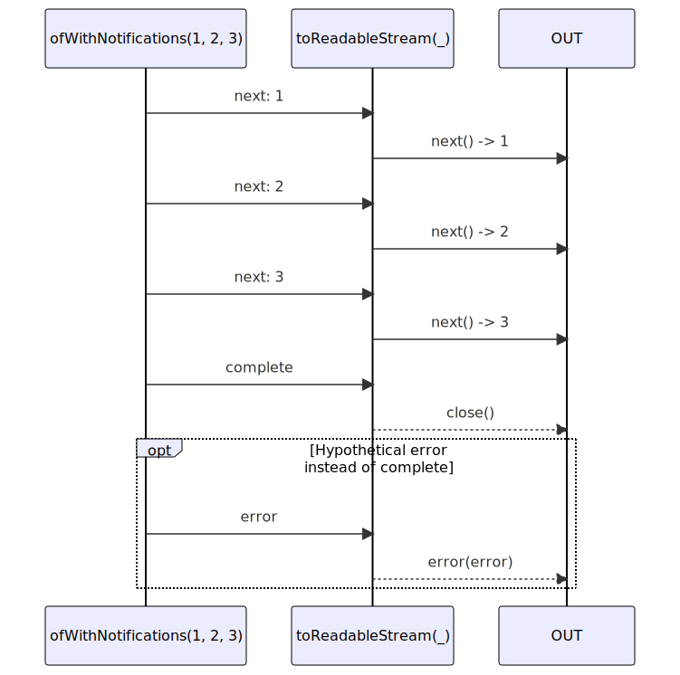

# toReadableStream

### Types

```ts
function toReadableStream<GValue>(
  subscribe: IObservable<IDefaultNotificationsUnion<GValue>>,
): ReadableStream<GValue>
```

### Definition

Converts an Observable of notifications into a ReadableStream.

### Diagram



### Example

#### Converts an Observable to a ReadableStream

```ts
const readable = toReadableStream(ofWithNotifications(1, 2, 3));
const reader = readable.getReader();

let result: ReadableStreamReadResult<number>;
while (!(result = reader.next()).done) {
  console.log(result.value);
}

console.log('done');
```

Output:

```text
1
2
3
'done'
```
